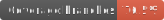

# Reapit Elements

   

A UI toolkit for building web applications in the Reapit Marketplace. Exports a library of React Components, JavaScript and TypeScript utilities and a CSS Stylesheet. For usage visit [here](https://foundations-documentation.reapit.cloud/api/web#elements).

- **Tech Stack**: React, Bulma, StoryBook, Sass / CSS Modules.
- **Cloud Services**: Github Pages
- **Production**: https://reapit.github.io/elements/

For detailed documentation [visit here](https://foundations-documentation.reapit.cloud/open-source/packages#elements).

